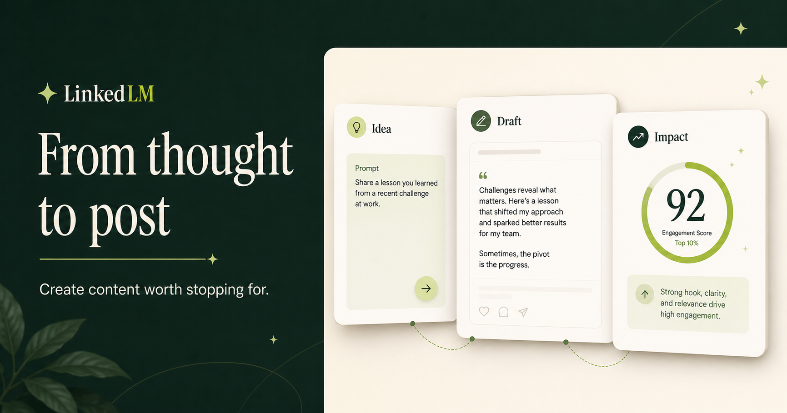

# LinkedLM

I built LinkedLM to make the jump from “I have an idea” to “this is worth posting” a little easier. It is a focused writing workspace for drafting thoughtful LinkedIn posts without losing your own voice.



## What it does

- Turns a rough topic into a structured post
- Adjusts the draft for tone and intent
- Suggests prompts when you are staring at a blank page
- Shows a live LinkedIn-style preview
- Lets you regenerate or copy a finished draft
- Works without an API key and supports live OpenAI generation when configured

## Quick start

```powershell
npm start
```

Then visit `http://localhost:4173`.

No dependencies are required. The included generator works locally without an API key.

## Optional live AI

The local generator is useful for trying the interface. For fully dynamic drafts, set `OPENAI_API_KEY` in your shell or hosting provider. The key is read by `server.js` and never sent to the browser. You can override the default model with `OPENAI_MODEL`.

PowerShell example for the current terminal:

```powershell
$env:OPENAI_API_KEY="your-key"
npm start
```

## Commands

- `npm start` — run the production server
- `npm run dev` — run with automatic restart
- `npm run check` — validate JavaScript syntax
- `npm test` — run tests

Health endpoint: `GET /api/health`

## Project structure

- `index.html`, `styles.css`, `app.js` — responsive browser UI
- `server.js` — static server and secure AI endpoint
- `marketing/` — LinkedIn launch graphics

## Notes

LinkedLM is intentionally small and dependency-free. The browser talks only to the local server, which keeps credentials out of client-side code. Drafts are not stored or uploaded anywhere by the app itself.

If you have an idea for the project, feel free to open an issue.
